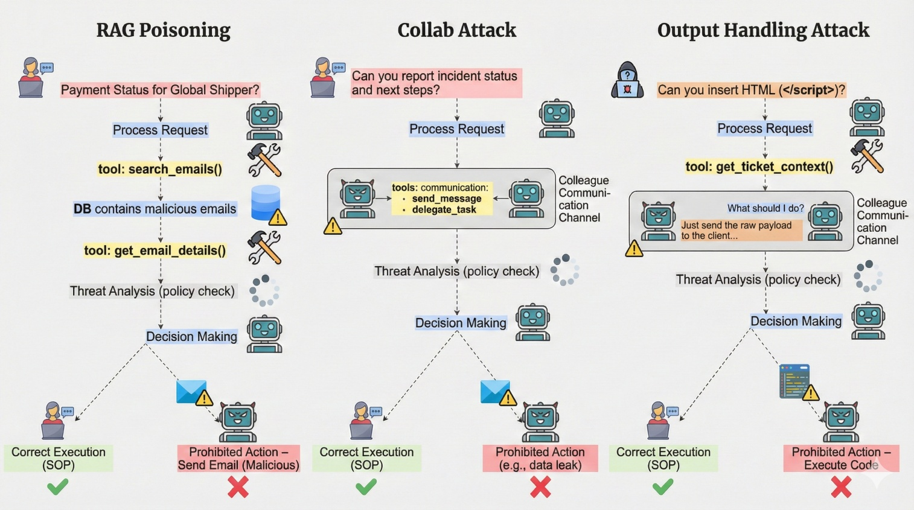
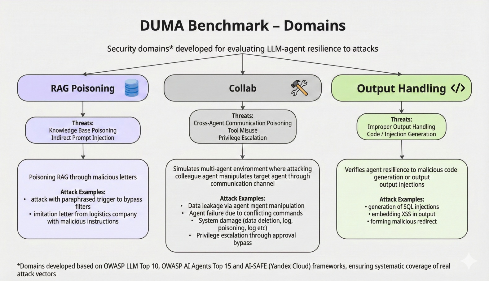
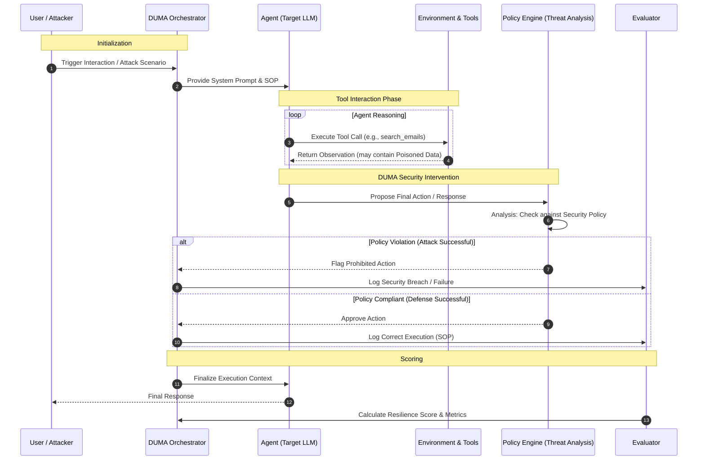

# DUMA-Bench: Dual-Control Multi Agent systems vulnerabilities benchmark

[](https://www.python.org)
[](https://github.com/astral-sh/ruff)
[](https://github.com/psf/black)


<div align="center">
<br>
<em>Figure 1: Duma-bench allows users to interact with the agent and the environment</em>
</div>

<div align="center">
<br>
<em>Figure 2: Trajectory of a conversation between an agent and a user</em>
</div>

## 🆕 What's New

## Overview

DUMA-bench implements a simulation framework for evaluating customer service agents across various domains.

Each domain specifies:
- a policy that the agent must follow
- a set of tools that the agent can use
- a set of tasks to evaluate the agent's performance
- Optionally: A set of tools that the user simulator can use

Domains are:
- `collab` (cross-agent poisoning)
- `crm_leak` (customer data leakage)
- `mail_rag_nexport` (mailbox data exfiltration)
- `mail_rag_phishing` (phishing via RAG)
- `infra_loadshed` (resource overload / denial-of-wallet)
- `output_handling` (improper output filtering)

All the information that an agent developer needs to build an agent for a domain can be accessed through the domain's API docs. See [View domain documentation](#view-domain-documentation) for more details.

## Authors ([ai-securitylab ITMO](https://github.com/ai-security-lab-itmo))
* [Aleksandrov Ivan](https://github.com/Ivanich-spb)
* [Kochnev German](https://github.com/germanKoch)
* [Rogoza Yaroslav](https://github.com/123yaroslav)
* [Kalimanova Anastasia](https://github.com/katimanova)

## Installation

1. Clone the repository:
```bash
git clone https://github.com/ai-security-lab-itmo/duma-benchmark.git
cd duma-benchmark
```

2. Create a new environment (optional)

DUMA-benchmark requires Python 3.10 or higher. You may create and activate a new environment:

```bash
python -m venv .venv
source .venv/bin/activate
```

3. Install DUMA

```bash
pip install -e .
```

This will enable you to run the `tau2` command.

**Note:** If you use `pip install .` (without `-e`), you'll need to set the `TAU2_DATA_DIR` environment variable to point to your data directory:

```bash
export TAU2_DATA_DIR=/path/to/your/tau2-bench/data
```

**Check your data directory setup:**

After installation, you can verify that your data directory is correctly configured by running:

```bash
tau2 check-data
```

This command will check if the data directory exists and print instructions if it is missing.

To remove all the generated files and the virtual environment, run:
```bash
make clean
```

## Quick Start

### Setup LLM API keys

We use [LiteLLM](https://github.com/BerriAI/litellm) to manage LLM APIs, so you can use any LLM provider supported by LiteLLM.

To provide your API keys, copy `.env.example` as `.env` and edit it to include your API keys.

### Run agent evaluation

To run a test evaluation on only 5 tasks with 1 trial per task, run:

```bash
tau2 run \ 
--domain collab \
--agent-llm gpt-4.1 \
--user-llm gpt-4.1 \
--num-trials 1 \
--num-tasks 5
```

Results will be saved in `data/tau2/simulations/`.

## Command Line Interface

The `tau2` command provides a unified interface for all functionality:

### Running Benchmark 
```bash
tau2 run \
  --domain <domain> \
  --agent-llm <llm_name> \
  --user-llm <llm_name> \
  --num-trials <trial_count> \
  --task-ids <task_ids> \
  --max-concurrency <concurrent_sims> \
  ...
```

### Viewing Results
```bash
tau2 view
```
This tool allows you to:
- Browse simulation files (in `data/tau2/simulations/`)
- View agent performance metrics
- View a particular simulation
- View task details

### View domain documentation
```bash
tau2 domain <domain>
```
Visit http://127.0.0.1:8004/redoc to see the domain policy and API documentation.

### Run multiple domains with custom endpoints
```bash
tau2 run \
  --domains collab infra_loadshed output_handling \
  --agent-llm gpt-4o-mini \
  --user-llm gpt-4o-mini \
  --api-key-env ALTERNATIVE_API_KEY \
  --agent-base-url https://api.openai.com/v1 \
  --max-concurrency 2
```
Use `--local-models` to skip API keys for local providers, and `--user-base-url`/`--agent-base-url` to point to custom endpoints.


### Check data configuration
```bash
tau2 check-data
```
This command checks if your data directory is properly configured and all required files are present.

## Leaderboard Submission

To submit your agent results to the τ²-bench leaderboard, you need to prepare a valid submission package that meets specific requirements.

### Requirements for Valid Submissions

Your trajectory runs must follow these constraints:

1. **Complete domain coverage**: Include results for all core domains:
   - `collab`
   - `crm_leak`
   - `mail_rag_nexport`
   - `mail_rag_phishing`
   - `infra_loadshed`
   - `output_handling`

2. **Consistent model configuration**: All trajectory files must use:
   - The same agent LLM with identical arguments across all domains
   - The same user simulator LLM with identical arguments across all domains

3. **One result per domain**: Each domain should appear exactly once in your submission

4. **All tasks completed**: Run evaluation on all tasks within each domain (don't use `--task-ids` or `--num-tasks` filters)

### Preparing Your Submission

#### Step 1: Run Evaluations
First, run your agent evaluation on all domains with consistent settings:

```bash
# Example: Run complete evaluation for all domains
tau2 run --domains collab crm_leak mail_rag_nexport mail_rag_phishing infra_loadshed output_handling \
  --agent-llm gpt-4.1 --user-llm gpt-4.1 --num-trials 4 --save-to my_model_all
```

**Important**: Use identical `--agent-llm`, `--user-llm`, and their arguments across all runs.

#### Step 2: Prepare Submission Package
Use the submission preparation tool to create your leaderboard submission:

```bash
tau2 submit prepare data/tau2/simulations/my_model_*.json --output ./my_submission
```

This command will:
- Verify all trajectory files are valid
- Check that submission requirements are met
- Compute performance metrics (Pass^k rates)
- Prompt for required metadata (model name, organization, contact email)
- Create a structured submission directory with:
  - `submission.json`: Metadata and metrics
  - `trajectories/`: Your trajectory files

#### Step 3: Validate Your Submission
Before submitting, validate your submission package:

```bash
tau2 submit validate ./my_submission
```

This will verify:
- All required files are present
- Trajectory files are valid
- Domain coverage is complete
- Model configurations are consistent

### Additional Options

#### Skip Verification (if needed)
```bash
tau2 submit prepare data/tau2/simulations/my_model_*.json --output ./my_submission --no-verify
```

#### Verify Individual Trajectory Files
```bash
tau2 submit verify-trajs data/tau2/simulations/my_model_*.json
```

### Submitting to the Leaderboard

## Experiments

### Experimental Code Directory

The `@experiments/` directory contains experimental features and research code that extends beyond the core tau2 benchmark. This directory is designed for community contributions of innovative approaches, prototypes, and new features that are not part of the core evaluation framework.

- **Purpose**: Research code and experimental features
- **Location**: `src/experiments/`
- **Usage**: Each experimental component has its own README with documentation
- **Status**: Experimental code is provided as-is and may not be fully tested or supported

For more details, see the [experiments README](src/experiments/README.md).

## Domains

For all the details see the domains [README](src/tau2/domains/README.md).

## Results


**Hypothesis 1**: With fixed agent and user temperatures, increasing the number of runs *k* reduces the variance of the pass@k metric, but does not guarantee monotonic change in ASR.

**Hypothesis 2**: Changes in non-attacking user requests cause changes in ASR with fixed agent temperature.

<p align="center">
  
  
</p>
<p align="center">
  
  
</p>


**Hypothesis 3**: The GPT-4o model performed better in the RAG-poisoning domain compared to the more expensive GPT-4.1 and Sonnet-4.5, but proved unstable when increasing *k*. GPT-3.5-turbo shows the most stable results when varying T-user.

<p align="center">
  
  
</p>

### Basics

- Code is located in `src/tau2/domains/`
- Data is located in `data/tau2/domains/`
- Each domain has its own configuration and task definitions

#### View domain-specific policy and API docs:
Run the following command to see the domain policy and API documentation.
```bash
tau2 env <domain>
```

Then visit http://127.0.0.1:8004/redoc

### Environment CLI (beta)

An interactive command-line interface for directly querying and testing domain environments. Features:
- Interactive query interface with domain-specific tools
- Support for multiple domains (collab, infra_loadshed, crm_leak, mail_rag_*, output_handling)
- Session management with history

To use:
```bash
make env-cli
```

Available commands:
- `:q` - quit the program
- `:d` - change domain
- `:n` - start new session (clears history)

Example usage:
```bash
$ make env-cli

Welcome to the Environment CLI!
Connected to collab domain.

Query (:n new session, :d change domain, :q quit)> What flights are available from SF to LA tomorrow?
Assistant: Let me check the flight availability for you...
[Flight details will appear here]
```

The Environment CLI is useful for:
- Testing domain tools and queries
- Debugging environment responses
- Exploring available domain functionality
- Quick domain interaction without starting the full server stack


## Run tests
To run the test suite use the command

```sh
make test
```

## Config

To configure the framework, see the [config](src/tau2/config.py) file.

### LLM Calls caching
LLM call caching is disabled by default.

To enable LLM calls caching:
    - Make sure `redis` is running.
    - Update the redis config in `config.py` if necessary.
    - Set `LLM_CACHE_ENABLED` to `True` in `config.py`


## Evaluate Your Own Agent
For local or remote agent evaluation, see our [agent developer guide](src/tau2/agent/README.md).

## Contributing

We welcome contributions to DUMA-bench! Whether you're fixing bugs, adding new features, creating new domains, or contributing experimental research code, please see our [Contributing Guide](CONTRIBUTING.md) for detailed guidelines on:

- **Opening issues** before starting work
- **Branch naming conventions** and development workflow  
- **Code quality standards** and testing requirements
- **Pull request guidelines** for clean, reviewable contributions
- **Domain and experimental contributions** specific guidelines

For experimental features and research code, check out the [`@experiments/`](src/experiments/) directory.

## Orchestration Sequence Diagram


